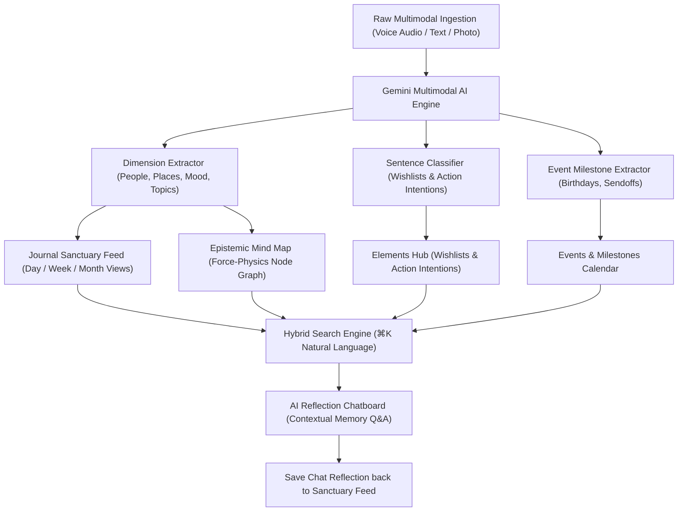

<p align="center">
  
</p>

# Memoiary — Personal Journaling App & Autobiographical Memory Engine

> **"Your memories, beautifully connected."**

**Memoiary** is an intelligent personal journaling app and private autobiographical memory engine powered by Next.js 15+, Google Cloud Run, Cloud Firestore, Firebase Authentication, and Gemini Multimodal AI.

The application acts as a quiet, objective mirror adhering to the cardinal principle:  
> **"The system remembers more than it says."**

---

## 🎨 Aesthetic & Design Philosophy

Memoiary is built with a signature visual identity:
- **Pencil & Graphite Linework**: All daily storyboards, narrative collages, and character visual identities are rendered in expressive hand-drawn sketch linework.
- **Parchment Stock & Terracotta Accents**: Textured `#FAF7F0` parchment stock palette paired with warm `#DE5239` terracotta highlights, warm gold `#D97706` mood badges, and tactile border outlines (`border-[1.5px] border-[#1C1917]`).
- **Tactile UI Controls**: Physical button shadows (`shadow-[2px_3px_0px_#1C1917]`), smooth micro-interactions, and sans/serif typography pairings.

---

## 🏛 Architecture & Data Flow



---

## ✨ Key Product Features

### 📖 1. Journal Sanctuary Timeline & Multi-Scale Views
- **Day View**: Granular chronological feed of text entries, transcribed voice audio notes, and photo memories.
- **Weekly Storyboard Arc**: 7-day visual recap collages with synthesized titles, summaries, and companion tags.
- **Monthly Collage Grid**: 30-day visual memory grid capturing broader emotional trajectories.
- **Memory Time Capsule ('On This Day')**: Historical date engine that automatically surfaces nostalgic reflections recorded on the exact date 1 month, 2 months, 3 months, or 1 year ago.

### 🎙️ 2. Multimodal AI Quick Capture (`+` Button)
- Real-time voice note audio recorder with zero-delay transcription.
- Photo and video memory upload.
- Automated Gemini dimension extraction: extracts tagged companions, geo-places, emotional valence, and key topics without requiring manual user tags.

### 🗓️ 3. Elements Hub
- **Events & Milestones Calendar**: Auto-detects upcoming birthdays, farewell gatherings, trips, and social milestones directly from journal entries with smart countdowns.
- **People & Places Network**: Maintains a directory of friends, family, and logged locations with shared moment counters and avatar cards.
- **Wishlists & Action Intentions**: Sentence-level regex classification filters out past completed events, separating aspirational desires (*recipes to try, places to visit*) from active commitments (*promises made, calls to make*).

### 🧠 4. Epistemic Mind Map & Graph Engine
- Interactive force-physics canvas clustering entity mentions across your journal.
- Draggable nodes branching out into **People**, **Places**, **Topics**, and **Key Memories**.

### 🔍 5. Hybrid AI Search Engine (`⌘K`)
- Natural language query processing (e.g. *"That cafe I went to with Sarah..."* or *"Moments that made me smile"*).
- Combines Gemini API semantic search with intelligent client-side keyword and entity tag matching across companions, locations, and content.
- Returns matched memory cards alongside human-readable explanation snippets (e.g., *"Tag: Sarah · Location: Roastery Coffee House"*).

### 💬 6. AI Reflection Chatboard
- Conversational journal assistant that queries your encrypted memory context to provide empathetic, context-aware answers.
- One-click **Save Chat Reflection** button persists key AI conversations directly into your timeline feed.

### 🧭 7. Interactive Guided Product Tour
- Non-intrusive, 7-step guided spotlight tour targeting compact navigation icons, date capsules, and view switchers without screen blur overlays.

---

## 🔒 Security & Privacy Architecture

Memoiary is built from the ground up to protect personal memories:

### 1. Local-First UID Scoping
All database collections, local storage keys (`memoiary_local_captures_${uid}`), and saved AI chat threads are strictly scoped to the user's unique ID (`user.uid`).

### 2. Zero Data Bleed Between Demo & User Accounts
Sample demo data (Maya, Kabir, Ananya sample entries) and authenticated user accounts are 100% isolated. Authenticated user data is never mixed with demo data.

### 3. Cloud Firestore Security Rules (`firestore.rules`)
Owner-bound access control guarantees that users can only read or write their own documents:

```javascript
rules_version = '2';
service cloud.firestore {
  match /databases/{database}/documents {

    // Default deny catch-all
    match /{document=**} {
      allow read, write: if false;
    }

    function isSignedIn() {
      return request.auth != null;
    }

    function isOwner(userId) {
      return isSignedIn() && request.auth.uid == userId;
    }

    function isValidId(id) {
      return id is string && id.size() <= 128 && id.matches('^[a-zA-Z0-9_\\-]+$');
    }

    // All memory collections belong strictly to the authenticated user's isolated document tree
    match /users/{userId} {
      allow read, write: if isOwner(userId);

      match /captures/{captureId} {
        allow read, write: if isOwner(userId) && isValidId(captureId);
      }

      match /episodes/{episodeId} {
        allow read, write: if isOwner(userId) && isValidId(episodeId);
      }

      match /entities/{entityId} {
        allow read, write: if isOwner(userId) && isValidId(entityId);
      }

      match /relationships/{relationshipId} {
        allow read, write: if isOwner(userId) && isValidId(relationshipId);
      }

      match /emotions/{emotionId} {
        allow read, write: if isOwner(userId) && isValidId(emotionId);
      }

      match /states/{stateId} {
        allow read, write: if isOwner(userId) && isValidId(stateId);
      }

      match /learnings/{learningId} {
        allow read, write: if isOwner(userId) && isValidId(learningId);
      }

      match /patterns/{patternId} {
        allow read, write: if isOwner(userId) && isValidId(patternId);
      }

      match /provenance/{provenanceId} {
        allow read, write: if isOwner(userId) && isValidId(provenanceId);
      }

      match /entries/{entryId} {
        allow read, write: if isOwner(userId) && isValidId(entryId);
      }

      match /memories/{memoryId} {
        allow read, write: if isOwner(userId) && isValidId(memoryId);
      }
    }
  }
}
```

---

## 🚀 Google Cloud Run & Infrastructure Setup

### Prerequisites
- [Google Cloud Project](https://console.cloud.google.com/) with Cloud Run & Firestore enabled.
- [Google Cloud SDK (`gcloud`)](https://cloud.google.com/sdk) installed.
- Gemini API Key from [Google AI Studio](https://aistudio.google.com/).

### Deployment via `gcloud` CLI

1. **Authenticate and set active GCP project**:
   ```bash
   gcloud auth login
   gcloud config set project YOUR_GCP_PROJECT_ID
   ```

2. **Deploy directly to Google Cloud Run from source**:
   ```bash
   gcloud run deploy memoiary \
     --source . \
     --region us-central1 \
     --allow-unauthenticated \
     --labels dev-tutorial=cloud-run-ai-challenge \
     --set-env-vars "GEMINI_API_KEY=your_gemini_api_key_here,NEXT_PUBLIC_FIREBASE_API_KEY=your_firebase_key"
   ```

3. **Deploy Firestore Security Rules**:
   ```bash
   firebase deploy --only firestore:rules
   ```

---

## 🛠 Local Development Setup

1. **Clone the repository**:
   ```bash
   git clone https://github.com/rpavani1998/memoiary.git
   cd memoiary
   ```

2. **Install dependencies**:
   ```bash
   npm install
   ```

3. **Configure local environment variables**:
   Create `.env.local` in the root directory:
   ```env
   GEMINI_API_KEY="your_gemini_api_key_here"
   NEXT_PUBLIC_FIREBASE_API_KEY="your_firebase_api_key"
   NEXT_PUBLIC_FIREBASE_AUTH_DOMAIN="your_firebase_project.firebaseapp.com"
   NEXT_PUBLIC_FIREBASE_PROJECT_ID="your_firebase_project_id"
   ```

4. **Launch development server**:
   ```bash
   npm run dev
   ```
   Open [http://localhost:3000](http://localhost:3000) in your browser.

---

## 🧰 Technology Stack

- **Framework**: Next.js 15+ (App Router, Server Actions, API Routes)
- **Styling & Aesthetics**: Tailwind CSS, Pencil & Graphite sketch design system, Google Fonts (Inter / Serif)
- **Database & Auth**: Google Cloud Firestore, Firebase Authentication
- **AI Cognitive Layer**: `@google/genai` TypeScript SDK, Gemini Multimodal API
- **Deployment & Hosting**: Google Cloud Run, Cloud Build
- **Icons**: Lucide React Icons

---

## 📄 License

MIT License — free to use, customize, and extend.
